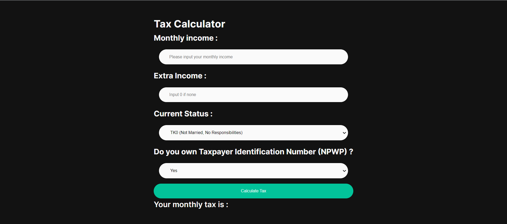

This app is available to see at : https://pdt-mid-term.herokuapp.com/

# PDT MID TERM

This Web App is made in order to satisfy the assigment from the Pyschology and Design Thinking Course.

## Getting Started

These instructions will give you a copy of the project up and running on
your local machine for development and testing purposes. 
### Dependencies

- [Python3](www.python.org)
- [PIP] (https://pip.pypa.io/en/stable/installation/)
- Flask

### Installing

Clone the git repo by running :
```
$ git clone https://github.com/i8g9/pdt-mid-term.git
```

After the cloning is successful, go to the folder by running :
```
$ cd ~/pdt-mid-term
```

If you don't have Flask, install Flask by running :
```
$ pip install Flask
```

To start the app run the following :
```
$ flask run
```

You should see this in your terminal/console :
```
* Environment: production
   WARNING: This is a development server. Do not use it in a production deployment.
   Use a production WSGI server instead.
 * Debug mode: off
 * Running on http://127.0.0.1:5000/ (Press CTRL+C to quit)
```

Go to your web browser of choice and open the following url :
```
http://127.0.0.1:5000/
```

## Authors

 + **Immanuel Azarya Garibaldi - 001202100116** - Created Front End; Deploying to Github and Heroku - [i8g9](https://github.com/i8g9)
 + **Muhammad Yusuf Kahlil Gibran - 001202100167** - Created Presentation
 + **Richie Lie Gunawan - 0012021000093** - Created Back End
 + **Tristan Jonah Pupella - 001202100108** - Created Diagram


## License

This project is licensed under the MIT License  

## Acknowledgments

 **Mr. Williem Sudiono** - Lecturer - [WilliemSudiono](https://github.com/WilliemSudiono)
